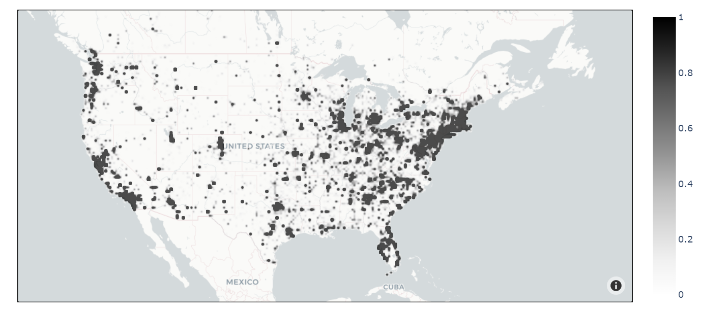

```{r setup, include=FALSE}
knitr::opts_chunk$set(echo = TRUE)
```

```{r include=FALSE}
library(tidyverse)
```

# Load in Data:

```{r include=FALSE}
data <- read_csv("../data/nuforc_reports.csv")
head(data)
```

## Cleaning Data

Examining the relation between the summary and text columns:

```{r echo=FALSE}
cat("Summary:\n",data$summary[1], "\n\n","Text:\n", data$text[1])
```

On inspecting the data, we can see that the summary is always a substring of the text column. Since it provides no additional information we can remove the summary column.

Plotting each sighting on a map using its longitude and latitude, we get the following:



We can see that the sightings are correlated with areas of higher population in general, which makes sense. One thesis we could test is checking whether these sightings happen disproportionately near areas with US military bases, which would lend some credence to conspiracy theories suggesting that sights such as Area 51 are areas of extra terrestrial activity

```{r include=FALSE}
data2 <- data %>% select(-summary)
data2
```

```{r include=FALSE}
# Load the ggmap package
# library(maps)
# 
# map <- get_map(location = c(lon = mean(data2$city_longitude, na.rm = TRUE),
#                             lat = mean(data2$city_latitude, na.rm = TRUE)),
#                             zoom = 10)
# 
# ggmap(map) +
#   geom_point(data = data2,
#              aes(x = city_longitude, y = city_latitude),
#              color = "red",
#              size = 3)
```

Let us look at the distribution of these reports with respect to time:

```{r echo=FALSE, warning=FALSE, fig.height = 3.5}
# warnings turned off, since we want to ignore NAs
ggplot(data2, aes(x = date_time)) +
  geom_histogram(aes(fill = shape), bins = 50) +
  labs(x = "time") + 
  theme_light()
```

We can see that there was a peak in the mid-2010s, with the distribution appearing fairly normal from \~2006 onwards. There were very few reports before that, but these reports were submitted online and that may be due to the fact that the internet was not as popular was it in recent years.

Although the relative proportions of the shapes of UFOs being reported seems to stay fairly constant throughout the years, we can look further into which shapes are more frequent occurrences and how their popularity changes over time:

```{r echo=FALSE, fig.height = 3.5}
library(forcats)
ggplot(data2, aes(x = fct_infreq(shape))) +
  geom_bar(aes(fill = shape)) +
  theme_light() +
  labs(
    x = "shapes"
  ) +
  theme(
    axis.text.x = element_text(angle = 90, vjust = 0.5, hjust=1),
    legend.position = "none"
  )
```

Looking at their frequency, we can see that light is by far the most popular, which may be due to the fact that this it is a more vague term that could be used to describe many possible shapes rather than something like chevron or crone, which is very specific.

The distant second place goes to circle, which may possess the same advantage due to its abstractness. Many may describe oval, disk and egg shapes as circles rather than place them in their own specific categories.

The rest of the labels smoothly taper off in terms of popularity, ending with cone and cross. Roughly `r 100 * mean(is.na(data2$shape))` of the reports did not mention a shape, meaning the vast majority of UFO encounters do have people making clear visual contact of the vessel.

*An interesting thesis to consider would be to find the relation between the shapes and occurrences of UFOs reported by people and coverage of them in news, media and other popular culture to see how related they are, and if it data indicates that one may be based off another.*

```{r echo=FALSE, warning=FALSE}
# warnings are turned off so because we want to ignore NA values
ggplot(data2, aes(x = date_time)) +
  geom_density(aes(fill = shape), alpha = 0.3) +
  labs(x = "time") +
  theme_light() + 
  theme(
    axis.text.y = element_blank()
  )
```

The overlapping shapes makes it harder to tell what's going on, stacking the density plots vertically gives us:

```{r echo=FALSE, warning=FALSE}
ggplot(data2, aes(x = date_time)) +
  geom_density(aes(fill = shape), alpha = 0.3, position = "stack") +
  labs(x = "time") +
  theme_light() + 
  theme(
    axis.text.y = element_blank()
  )
```

From the above graph we can see:

-   The vast number of different categories makes the data hard to analyse. Since many of these are very similar, they can be wrapped up into larger parent categories. For example, light, fireball and flash can be combined into a single category; circle, oval, egg etc. can be combined into another, and so on.

<!-- -->

-   The distribution appears to be tri-modal

-   The second mode is the largest, and contains a narrow and steep peak of reports, motly of light-shaped UFOs. This warrants further investigation into real life events at the time to see if this can be explained by events happening at the time.

-   The third peak of NA shapes seems to be the most recent. This could be a problem with data collection and also warrants investigation

```{r include=FALSE}
data2$shape[data2$shape == "flash"] = "light"
data2$shape[data2$shape == "fireball"] = "light"

data2$shape[data2$shape == "changing"] = "formation"

data2$shape[data2$shape == "cigar"] = "cylinder"

data2$shape[data2$shape == "diamond"] = "rectangle"

data2$shape[data2$shape == "disk"] = "circle"
data2$shape[data2$shape == "egg"] = "circle"
data2$shape[data2$shape == "teardrop"] = "circle"
data2$shape[data2$shape == "oval"] = "circle"
data2$shape[data2$shape == "sphere"] = "circle"

data2$shape[data2$shape == "cone"] = "triangle"
```

Combining the categories, these are all the shapes that had other shapes absorbed into them. The rest of the categories remain unchanged:

+----------+----------+----------+-----------+-----------+----------+
| Light    | Circle   | Triangle | Rectangle | Formation | Cylinder |
+==========+==========+==========+===========+===========+==========+
| Flash    | Disk     | Cone     | Diamond   | Changing  | Cigar    |
|          |          |          |           |           |          |
| Fireball | Egg      |          |           |           |          |
|          |          |          |           |           |          |
|          | Teardrop |          |           |           |          |
|          |          |          |           |           |          |
|          | Oval     |          |           |           |          |
|          |          |          |           |           |          |
|          | Sphere   |          |           |           |          |
+----------+----------+----------+-----------+-----------+----------+

Examining the second graph again with our new shapes, and zooming to the 2nd mode:

```{r echo=FALSE, warning=FALSE, fig.height = 3.5}
# warnings are turned off so because we want to ignore NA values
ggplot(data2, aes(x = date_time)) +
  geom_density(aes(fill = shape), alpha = 0.3, position = "stack") +
  labs(x = "time") +
  xlim(as.POSIXct("2010-1-1"), as.POSIXct("2020-1-1")) +
  theme_light() + 
  theme(
    axis.text.y = element_blank()
  )
```

Moving on from the shapes, next let's examine what part of the year these sightings normally take place in to see if they are more common during certain seasons

```{r echo=FALSE, warning=FALSE}

data3 <- data2 %>% 
  mutate("date_no_year" = as.POSIXct(
    format(date_time, format = "%m-%d"),
    format = "%m-%d")
    )

ggplot(data3,
       aes(x = date_no_year)) +
  geom_density(aes(fill = shape), alpha = 0.3) +
  labs(x = "time") +
  theme_light() +
  theme(
    axis.text.y = element_blank()
  )
```

The sightings seem to increase slowly throughout the year, with peaks in July, and curiously, a second peak of only chevron shaped UFOs around November. The second peak may likely be a single event that was reported by many people which is skewing the results and warrants further investigation.

### Ideas for research questions:

1.  *Are UFO sightings more likely to occur in certain geographic regions or at particular times of the year?*

2.  *Is there any correlation between reported UFO sightings and the presence of military installations or other government facilities?*

3.  *Can machine learning algorithms accurately classify UFO sightings based on their reported characteristics, such as shape or color?*

4.  *Are there any patterns or trends in the language used to describe UFO encounters, and can these patterns shed light on the psychological or cultural factors that contribute to belief in UFOs?*

5.  *Are there any demographic or other social factors that predict belief in UFOs or likelihood of reporting a sighting?*

6.  *How has media coverage and public perception of UFOs changed over time, and what factors have contributed to these shifts?*

7.  *Is there any evidence to suggest that UFO sightings could be linked to extraterrestrial life, or are there other explanations that can account for these phenomena?*
